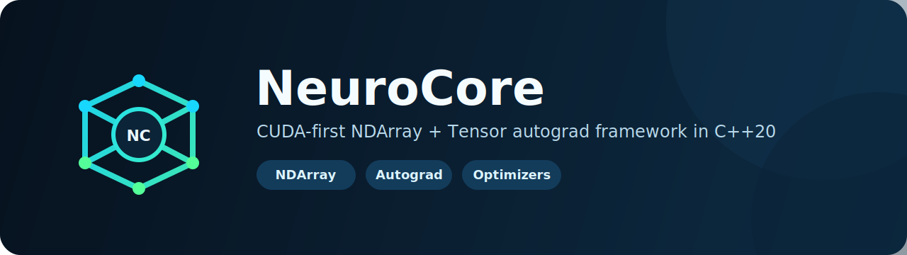
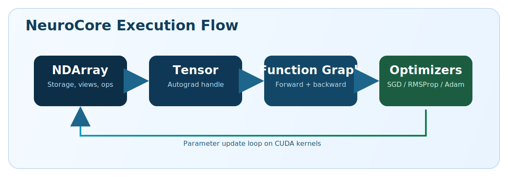

# NeuroCore

<p align="center">
  
</p>

<p align="center">
  <strong>CUDA-first C++ deep learning framework</strong> for GPU-native tensor computation, autograd, and custom CUDA kernel execution.
</p>

<p align="center">
  
  
  
  
</p>

---

## Framework At A Glance

NeuroCore combines four core pieces: `NDArray<T>` for GPU array storage and ops, `Tensor<T>` for autograd-enabled graph tensors, `Function` classes for graph-backed arithmetic/math, and fused CUDA optimizers (`SGD`, `RMSProp`, `Adam/AdamW`).

---

## Architecture

<p align="center">
  
</p>

Flow: `NDArray` data ops -> `Tensor` graph ops -> `backward()` gradient propagation -> fused optimizer `step()`.

---

## CUDA Implementation Details

NeuroCore's core compute paths are custom CUDA kernels, not wrapper calls around external tensor libraries.

- **Elementwise kernels** (`include/neurocore/core/elementwise_kernels.cuh`):
  - `elementWiseKernelContiguous` for dense contiguous arrays
  - `elementWiseKernelStrided` for views/non-contiguous arrays
  - `gatherKernel` for index-based slicing
- **Gradient kernels** (`include/neurocore/functions/grad_kernels.cuh`):
  - `gradKernelContiguous` and `gradKernelStrided`
  - reusable grad functors for div/pow/exp/log/raise/clip/`sin/cos/tan/cot/asin/acos/atan/acot`
- **Fused optimizer kernels** (`include/neurocore/optim/optim_kernels.cuh`):
  - `fusedSGDKernel`, `fusedRMSPropKernel`, `fusedAdamKernel`
  - parameter update math is done directly on GPU in one fused pass per optimizer step
- **Launch behavior**:
  - NDArray uses a default `256` threads/block strategy
  - block count is computed from tensor size and capped by SM count (`utils::getNBlocks`)
  - fast path for contiguous tensors, strided path for views/broadcasted layouts
- **Memory model**:
  - NDArray payload uses `cudaMallocManaged`
  - shape/stride metadata is copied to device buffers when strided kernels need it
  - framework tracks total managed GPU allocation via a static counter

---

## Implemented API Surface (High-Level)

### NDArray (`arr::` + operators)

- Data model: value-style arrays with view support (`offset + strides`) and scalar/slice/gather indexing.
- Ops: `+ - * /` (array-array, array-scalar, scalar-array), unary negation, forward broadcasting, and functional APIs:
  `add/subtract/subs`, `multiply/mul`, `divide/div`, `power/pow`, `raise`, `exp/log`,
  `sin/cos/tan/cot`, `asin/acos/atan/acot`, `sigmoid`, `abs`, `sign`, `clip`.
- Utilities: `transpose`, `transposeInPlace`, `cast<T>`, `zeros_like`, `ones_like`, `toVector`.
- Cross-type overloads via common-type macros.

### Tensor (`tensor::`)

- Data model: handle-style tensors over shared `TensorImpl` (`data`, optional `grad`, flags, `gradFn`).
- Graph ops: `+ - * /`, `power/pow`, and wrappers
  `exp/log/log2/log10`, `raise/square/cube/sqrt/cbrt`,
  `sin/cos/tan/cot`, `asin/acos/atan/acot`, `abs`, `clip`.
- Autograd: parent-link graph construction in forward ops and topological gradient propagation in `backward()`.
- Controls/factories: `requiresGrad`, `zeroGrad`, `detach`, cast with gradient propagation, `tensor::zeros`, `tensor::ones`.

### Optimizers

- `SGD`: momentum update kernel.
- `RMSProp`: running-square-momentum kernel.
- `Adam`/`AdamW`: bias-corrected adaptive kernel.
- Shared features: variant parameter list, weight decay, time step counter, compute dtype (`HALF/FLOAT/DOUBLE`).

---

## Build & Run

### Requirements

- CUDA Toolkit (`12.x`, tested with `12.3`)
- CMake `>= 4.0`
- C++20 compiler
- Windows: MSVC / Visual Studio 2022 Build Tools

### Build

```bat
call "<VS_INSTALL_DIR>\VC\Auxiliary\Build\vcvars64.bat"
cmake -S . -B cmake-build-debug -G Ninja
cmake --build cmake-build-debug --config Debug
```

If your shell resolves an older CMake (<4.0), run a newer `cmake.exe` explicitly.

### Run

```bat
cmake-build-debug\NeuroCore.exe
```

---

## Training Example

```cpp
#include <vector>
#include "core/tensor.cuh"
#include "functions/arithmetic.cuh"
#include "optim/adam.cuh"

// Learn y = 2x + 1 from one sample (x=2, y=5)
Tensor<float> x_in = tensor::ones<float>({1}, false);
Tensor<float> y_true = tensor::ones<float>({1}, false);
x_in.data()[std::vector<int>{0}] = 2.0f;
y_true.data()[std::vector<int>{0}] = 5.0f;

Tensor<float> w = tensor::zeros<float>({1}, true);
Tensor<float> b = tensor::zeros<float>({1}, true);

std::vector<tensor::TensorPtrVariant> params = {w.get(), b.get()};
Adam optimizer(params, 0.1f, 0.0f, 0.9f, 0.999f);

for (int step = 0; step < 100; ++step) {
    optimizer.zeroGrad();
    auto y_pred = w * x_in + b;
    auto err = y_pred - y_true;
    auto loss = err * err;
    loss.backward();
    optimizer.step();
}

// w -> ~2, b -> ~1
```

---

## Current Gaps (Known, Explicit)

- Broadcast gradient reduction is not implemented yet (`reduceGradToShape` throws when reduction is required).
- `nn/` and `random/` modules are currently placeholders.

---

## Repository Layout

```text
NeuroCore/
  examples/
    demo_main.cu
  include/
    neurocore/
      core/
        elementwise_kernels.cuh
        exceptions.h
        ndarray.cuh
        slices.h
        tensor.cuh
        type_traits.cuh
        utils.h
      functions/
        arithmetic.cuh
        base.cuh
        grad_kernels.cuh
        math.cuh
      optim/
        adam.cuh
        optimizer.h
        optim_kernels.cuh
        rmsprop.cuh
        sgd.cuh
      nn/          (placeholder)
      random/      (placeholder)
  src/
    core/
      slices.cu
      utils.cu
    optim/
      adam.cu
      rmsprop.cu
      sgd.cu
    nn/            (placeholder)
    random/        (placeholder)
  docs/assets/     (branding visuals used by README)
  benchmarks/      (currently empty)
```
