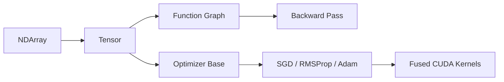

# NeuroCore

<p align="center">
  
</p>

<p align="center">
  <strong>CUDA-first deep learning framework in modern C++</strong><br/>
  NDArray core, Tensor autograd, and fused optimizers (SGD / RMSProp / Adam).
</p>

<p align="center">
  
  
  
  
</p>

<p align="center">
  
</p>

---

## What NeuroCore Currently Includes

NeuroCore is a header-heavy CUDA/C++ framework with:

- `NDArray<T>` for GPU-backed n-dimensional arrays
- `Tensor<T>` handle-style autograd tensors (`shared_ptr` internals)
- Function graph primitives for backward propagation
- Fused CUDA optimizer kernels (`SGD`, `RMSProp`, `Adam`)
- Rich exception hierarchy for shape/index/CUDA/backprop errors
- Interactive demo showcasing framework behavior end-to-end

---

## Architecture (Current)

<p align="center">
  
</p>

<details>
<summary><strong>Show Mermaid Diagram</strong></summary>



</details>

---

## Repository Layout

```text
NeuroCore/
  CMakeLists.txt
  examples/
    demo_main.cu
  include/neurocore/
    core/
      elementwise_kernels.cuh
      exceptions.h
      ndarray.cuh
      slices.h
      tensor.cuh
      type_traits.cuh
      utils.h
    functions/
      arithmetic.cuh
      base.cuh
      grad_kernels.cuh
      math.cuh
    optim/
      adam.cuh
      optimizer.h
      optim_kernels.cuh
      rmsprop.cuh
      sgd.cuh
    nn/        (placeholder)
    random/    (placeholder)
  src/
    core/
      slices.cu
      utils.cu
    optim/
      adam.cu
      rmsprop.cu
      sgd.cu
    nn/        (placeholder)
    random/    (placeholder)
```

---

## Build and Run

### Requirements

- CUDA Toolkit (tested with `12.3`)
- CMake `>= 4.0`
- C++20-capable compiler
- On Windows: Visual Studio 2022 Build Tools / MSVC

### Configure + Build (Windows terminal)

```bat
call "<VS_INSTALL_DIR>\VC\Auxiliary\Build\vcvars64.bat"
cmake -S . -B cmake-build-debug -G Ninja
cmake --build cmake-build-debug --config Debug
```

If your terminal resolves an older CMake (<4.0), use a newer `cmake.exe` explicitly (for example CLion-bundled CMake).

### Run Demo

```bat
cmake-build-debug\NeuroCore.exe
```

Demo menu covers:

1. NDArray basics (templates, copy, operators)
2. Tensor + autograd backward
3. Optimizers and polymorphism
4. Exception hierarchy + propagation
5. Simple training loop (`(x-3)^2`)
6. Framework info summary

---

## API Inventory (Current Code)

### 1) Core: Exceptions

Base:

- `NeuroCoreException`

Derived:

- `SizeMismatchException`
- `NDimMismatchException`
- `ShapeMismatchException`
- `IndexingException`
- `CudaKernelException`
- `BackPropException`

---

### 2) Core: `Shape` and `Slice`

`Shape`:

- `Shape(std::initializer_list<int>)`
- `Shape(std::vector<int>)`

`Slice` supports:

- range slicing: `Slice(start, stop, step)`
- explicit index slicing: `Slice(std::vector<int>)`
- index sources from `NDArray<int>` and `Tensor<int>`
- iterable interface (`begin/end`)

---

### 3) Core: `NDArray<T>`

### Constructors and lifetime

- default constructor
- allocator constructor: `NDArray(const Shape&)`
- view constructor from raw pointer + shape/strides/offset
- copy constructor
- constructor from nested vectors
- move constructor / move assignment
- destructor with managed memory ownership semantics

### Accessors / metadata

- `getData()`, `getShape()`, `getNDim()`, `getSize()`
- `getStrides()`, `setStrides(...)`
- `getItemBytes()`, `getOffset()`, `getOwnsData()`
- `getNBLOCKS()`, `getNTHREADS()`
- static `getTotalAllocatedMemory()`
- `synchronize()`
- `isContiguous()`

### Indexing and slicing

- scalar index access via `operator[](std::vector<int>)`
- slicing via `operator[](std::vector<Slice>)`
- advanced gather indexing kernel path for index-based slices

### Assignment and arithmetic operators

- assignment: scalar / array / nested vector
- unary: negation
- binary array-array and array-scalar:
  - `+`, `-`, `*`, `/`
- reverse scalar operators:
  - `scalar + array`, `scalar - array`, `scalar * array`, `scalar / array`

### Other operations

- `transpose(...)`
- `transposeInPlace(...)`
- `toVector()` (1D conversion)
- `cast<newDtype>()`
- `zeros_like()`, `ones_like()`
- stream operators: `<<`, `>>`

### Broadcasting

- forward broadcasting implemented in elementwise execution via stride-zero views
- shape compatibility checks via `getBroadcastInfo(...)`

### NDArray variants

- `arr::NDArrayVariant` = `int | float | double | __half`
- `arr::NDArrayPtrVariant` pointer variant counterpart

---

### 4) `arr::` Functional API (NDArray namespace)

Factories:

- `make_constant`, `make_zeros`, `make_ones`

Binary elementwise:

- `add`, `subtract`, `subs`
- `multiply`, `mul`
- `divide`, `div`
- `power`, `pow`

Unary/math:

- `raise`
- `exp`, `log`
- `sin`, `cos`, `tan`, `cot`
- `asin`, `acos`, `atan`, `acot`
- `sigmoid`
- `abs`, `sign`, `clip`

Cross-type overloads are auto-generated via macros in `type_traits.cuh`.

---

### 5) Core: `Tensor<T>` + Autograd

`Tensor<T>` is a handle object over `TensorImpl<T>` (`shared_ptr` based).

### Tensor state and behavior

- stores `data`, optional `grad`, `requiresGrad`, `isLeaf`
- supports `zeroGrad()`, `backward()`, `detach()`
- accessors: `data()`, `grad()`, `shape()`, `size()`
- cast with gradient bridge: `cast<newDtype>()`

### Backward mechanism

- graph traversal is topologically ordered
- gradients accumulate in parents via `Function::backward(...)`
- cast-parent gradient propagation is supported

### Tensor variants

- `tensor::TensorVariant` = `int | float | double | __nv_bfloat16`
- `tensor::TensorPtrVariant` pointer variant counterpart

Factories:

- `tensor::zeros(...)`
- `tensor::ones(...)`

---

### 6) `Function` Layer

Base abstraction:

- `class Function<T>`
  - `forward()`
  - `backward(outGrad)`
  - parent tensor-impl tracking

Gradient kernels/utilities:

- contiguous + strided generic grad kernels
- gradient functors for div/pow/exp/log/raise/abs/clip and trig families
- `executeGrad(...)` wrapper

---

### 7) `tensor::` Arithmetic API

Graph-backed operators:

- `operator+`, `operator-`, unary `operator-`, `operator*`, `operator/`

Functional aliases:

- `add`, `subtract`, `subs`
- `multiply`, `mul`
- `divide`, `div`
- `power`, `pow`

Cross-type tensor binary overloads are generated via macros.

---

### 8) `tensor::` Math API (header-level)

Declared function wrappers and corresponding `Function` classes for:

- `exp`, `log`, `log2`, `log10`
- `raise`, `square`, `cube`, `sqrt`, `cbrt`
- `abs`
- `sin`, `cos`, `tan`, `cot`
- `asin`, `acos`, `atan`, `acot`
- `clip`

---

### 9) Optimizers

Base:

- `Optimizer` with virtual `step()`
- `zeroGrad()` across variant tensor parameter list
- common hyperparameters: `lr`, `weightDecay`, step counter `t`
- compute dtype switch: `HALF | FLOAT | DOUBLE`

Implemented optimizers:

- `SGD` (momentum, fused kernel)
- `RMSProp` (moving average of squared grads)
- `Adam` / `AdamW` mode (bias correction)

Implementation details:

- fused kernels in `optim_kernels.cuh`
- momentum buffers stored as `NDArray<float>` for numerical stability
- CUDA error checks after each optimizer step

---

## Design Notes

- GPU memory: `cudaMallocManaged` for NDArray storage
- Views: non-owning NDArray slices share storage via offset/strides
- Runtime polymorphism: optimizer hierarchy demonstrates upcast/downcast usage
- Cross-dtype operator ergonomics via `cuda::std::common_type_t` macros

---

## Current Limitations / WIP

- Broadcast gradient reduction is not implemented yet (`reduceGradToShape` throws when reduction is needed).
- `tensor::transpose(...)` is declared but not fully wired in current sources.
- `nn/` and `random/` modules are scaffolded but still empty.
- Demo currently validates arithmetic/autograd/optimizers; broader math API paths are present in headers and should be treated as active development.

---

## Quick Example (From Current Capabilities)

```cpp
#include "core/tensor.cuh"
#include "functions/arithmetic.cuh"

Tensor<float> x = tensor::zeros<float>({1}, true);
Tensor<float> y = tensor::zeros<float>({1}, true);
x.data()[std::vector<int>{0}] = 3.0f;
y.data()[std::vector<int>{0}] = 4.0f;

auto z = x * y;
z.backward();
// x.grad() ~ 4, y.grad() ~ 3
```

---

## Suggested Next Steps

1. Finalize `tensor::transpose` implementation.
2. Implement broadcast-aware gradient reduction kernel.
3. Add unit tests for `arr::` and `tensor::` math paths.
4. Start filling `nn/` and `random/` modules (layers, initializers, RNG/curand wrappers).
